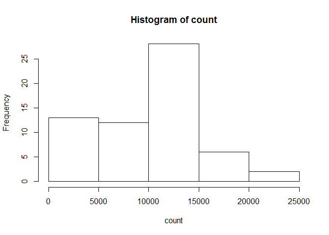
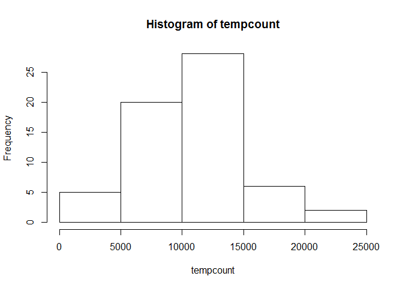
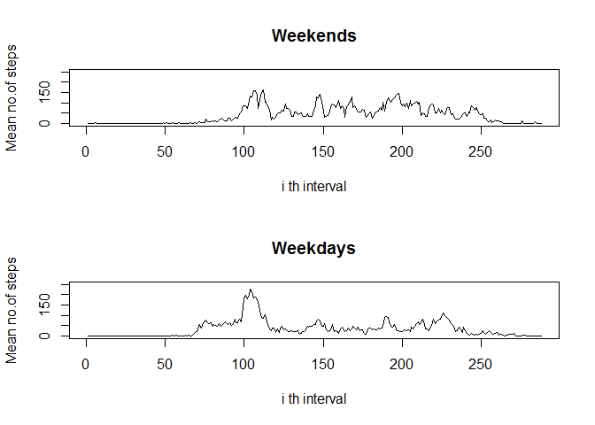

# Reproducible Research: Peer Assessment 1


## Loading and preprocessing the data
The data is loaded from the given dataset as zipped file.
 

```r
sample<- read.csv(unz("activity.zip","activity.csv"))
```

## What is mean total number of steps taken per day?
The total number of steps taken on each day is calculated by adding all the intervals of one particular day.
The average number of steps taken is calculating by taking mean of total number of steps on each day.
The histogram of the total number of steps on each day is made and also the mean and median of the number of steps on each day is displayed

```r
count<- rep(0,length(sample[,1])/288)

for(i in 1:length(sample[,1]))
{
   j<- as.integer((i-1)/288) + 1
   if(!is.na(sample[i,1]))
  {
    count[j] = count[j] + sample[i,1]
  }
}
hist(count)
```

 

```r
mean(count)
```

```
## [1] 9354.23
```

```r
median(count)
```

```
## [1] 10395
```

## What is the average daily activity pattern?
We have plotted the average number of steps taken in each 5 min interval throughout the day.

```r
timeintcount<- rep(0, 288)
for(i in 1:length(sample[,1]))
{
  if(!is.na(sample[i,1]))
  { 
    timeintcount[(i-1)%%288 + 1] = timeintcount[(i-1)%%288 + 1] + sample[i,1]
  }  
}
timeintcount = timeintcount/61
plot(timeintcount, type='l', xlab = 'i th interval', ylab = 'No.of steps in 61 days')
```

 

```r
which.max(timeintcount)
```

```
## [1] 104
```


## Imputing missing values
I have taken the missing values as the mean of steps at that time interval of all the days. This is realistic compared to taking mean of the steps of time intervals on one day because if he takes less steps on other days at that particular time there is more chances that he less steps on that day too and vice versa.
There is slight change in the values of mean but not in the median as some missing values are replaced with some positive values but this does account so much that it changes the value of median.

```r
length(which(is.na(sample[,])))
```

```
## [1] 2304
```

```r
filledsample<- sample
for(i in which(is.na(sample[,1])))
{
  filledsample[i,1] = timeintcount[(i-1)%%288 + 1]
}

tempcount<- rep(0,length(filledsample[,1])/288)

for(i in 1:length(filledsample[,1]))
{
   j<- as.integer((i-1)/288) + 1
   tempcount[j] = tempcount[j] + filledsample[i,1]
}
hist(tempcount)
```

 

```r
mean(tempcount)
```

```
## [1] 10581.01
```

```r
median(tempcount)
```

```
## [1] 10395
```

## Are there differences in activity patterns between weekdays and weekends?
Yes, there are significant differences. In the weekends the rate is a bit uniform but at some particular intervals on weekdays the number of steps is very high compared to others.

```r
day<- weekdays(as.POSIXct(filledsample[,2]))
countend<- 0
countday<- 0
timeintcountend<- rep(0, 288)
timeintcountday<- rep(0, 288)
for(i in 1:length(filledsample[,1]))
{
  if(day[i] == "Saturday" || day[i] == "Sunday")
  {
    countend = countend + 1
    timeintcountend[(i-1)%%288 + 1] = timeintcountend[(i-1)%%288 + 1] + filledsample[i,1]
  }
  else
  {
    countday = countday + 1
    timeintcountday[(i-1)%%288 + 1] = timeintcountday[(i-1)%%288 + 1] + filledsample[i,1]
  }
  
}
timeintcountend = timeintcountend*288/countend
timeintcountday = timeintcountday*288/countday
par(mfrow = c(2,1))
plot(timeintcountend, type='l', xlab = 'i th interval', ylab = 'Mean no.of steps', ylim = c(0,250), main = 'Weekends')
plot(timeintcountday, type='l', xlab = 'i th interval', ylab = 'Mean no.of steps', ylim = c(0,250), main = 'Weekdays')
```

 
