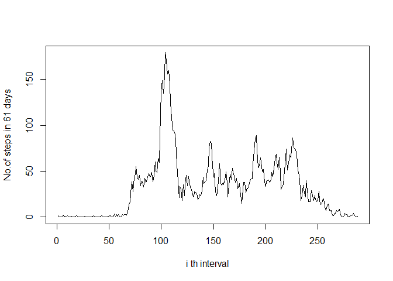

# Reproducible Research: Peer Assessment 1


## Loading and preprocessing the data
The data is loaded from the given dataset as zipped file.
The total number of steps taken on each day is calculated by adding all the intervals of one particular day.

```r
sample<- read.csv(unz("activity.zip","activity.csv"))
count<- rep(0,length(sample[,1])/288)

for(i in 1:length(sample[,1]))
{
   j<- as.integer((i-1)/288) + 1
   if(!is.na(sample[i,1]))
  {
    count[j] = count[j] + sample[i,1]
  }
}
```

## What is mean total number of steps taken per day?
The average number of steps taken is calculating by taking average of total number of steps on each day.

```r
mean(count)
```

```
## [1] 9354.23
```

## What is the average daily activity pattern?


```r
median(count)
```

```
## [1] 10395
```

```r
timeintcount<- rep(0, 288)
for(i in 1:length(sample[,1]))
{
  if(!is.na(sample[i,1]))
  { 
    timeintcount[(i-1)%%288 + 1] = timeintcount[(i-1)%%288 + 1] + sample[i,1]
  }  
}
timeintcount = timeintcount/61
plot(timeintcount, type='l', xlab = 'i th interval', ylab = 'No.of steps in 61 days')
```

 

```r
which.max(timeintcount)
```

```
## [1] 104
```

```r
length(which(is.na(sample[,])))
```

```
## [1] 2304
```


## Imputing missing values
I have taken the missing values as the mean of steps at that time interval of all the days. This is realistic compared to taking mean of the steps of time intervals on one day because if he takes less steps on other days at that particular time there is more chances that he less steps on that day too and vice versa.

```r
filledsample<- sample
for(i in which(is.na(sample[,1])))
{
  filledsample[i,1] = timeintcount[(i-1)%%288 + 1]
}
```

## Are there differences in activity patterns between weekdays and weekends?
